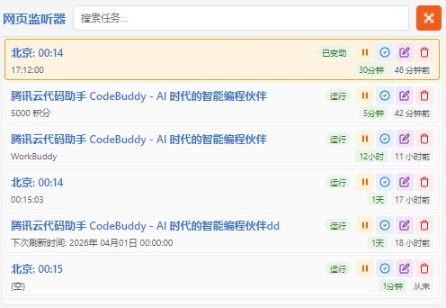
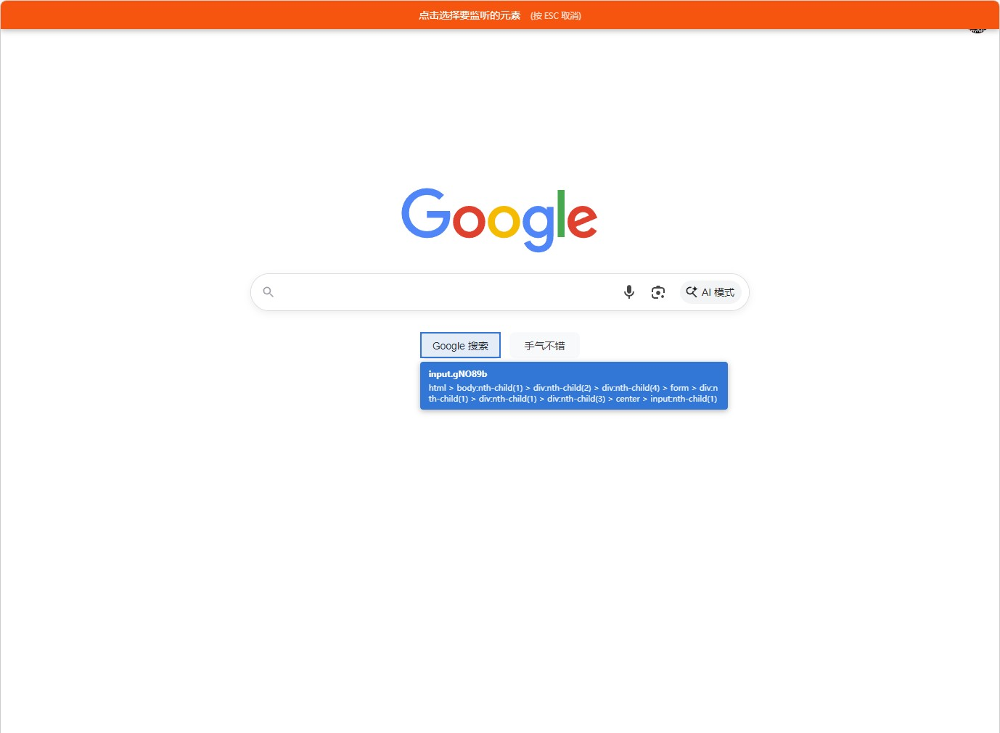
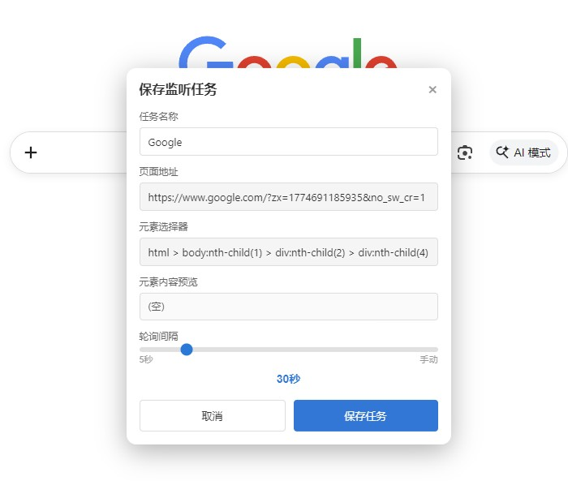

中文文档 | [English Documentation](./README.md)

# 网页监听器 (Element Monitor)

一款 Chrome/Edge 浏览器扩展，用于监听指定网页元素的变化，并在检测到变化时发送系统通知。

## 功能特性

- **元素选择** - 类似 DevTools 的页面元素选择器，或通过右键菜单选择
- **定时监听** - 支持 1 分钟 ~ 1 周的轮询间隔，支持自定义分钟输入，或仅手动检查
- **变化通知** - 系统通知 + 扩展图标 Badge 显示未读变化数量
- **通知点击** - 点击系统通知自动标记已读，Badge 数字自动扣减
- **任务指标** - 每个任务显示检测次数、上次检测时间、上次变化时间
- **智能调度** - 任务队列排他锁，防止并发检测；忙碌时自动顺延 5 秒执行
- **任务搜索** - 实时搜索筛选任务
- **任务排序** - 有变化的任务优先显示，按最后变化时间排序

## 截图展示

|            弹窗界面             |             元素选择器             |             保存对话框             |
| :-----------------------------: | :--------------------------------: | :--------------------------------: |
|  |  |  |

## 快速使用

1. 点击扩展图标，再点击元素选择按钮
2. 在页面上点击要监听的元素
3. 设置任务名称和轮询间隔，保存
4. 元素变化时会收到系统通知
5. 点击通知可打开页面并标记已读

## 轮询间隔选项

### 快速选择

1分钟、5分钟、10分钟、30分钟、1小时、6小时、12小时、1天、1周、手动

### 自定义间隔

输入任意分钟数（1 ~ 525600），自动显示易读格式（如输入 70 分钟，显示"1小时10分钟"）。

## 任务调度机制

- 使用 `chrome.alarms` API 实现可靠定时调度（最低 1 分钟）
- Service Worker 启动时仅创建缺失的 alarm，不重置已有的调度
- 首次触发时间根据 `lastCheck` + `interval` 计算，避免不必要的等待
- 每次检查完成后，基于最新的 `lastCheck` 重建 alarm，确保下次触发时间准确
- 同一时间只允许一个任务执行检测，其他任务自动顺延 5 秒后重试

## 项目结构

```
element-monitor-extension/
├── manifest.json
├── _locales/
│   ├── en/messages.json
│   └── zh_CN/messages.json
├── background/
│   └── background.js
├── popup/
│   ├── popup.html
│   ├── popup.css
│   └── popup.js
├── content/
│   ├── content.js
│   └── picker.js
└── icons/
    ├── icon16.png
    ├── icon48.png
    └── icon128.png
```

## 主要 API

| API                  | 用途               |
| -------------------- | ------------------ |
| chrome.storage.local | 任务数据存储       |
| chrome.alarms        | 定时任务调度       |
| chrome.notifications | 系统通知           |
| chrome.tabs          | 标签页管理         |
| chrome.scripting     | 脚本注入           |
| chrome.contextMenus  | 右键菜单           |

## 数据结构

```javascript
{
  id: "task_xxx",
  url: "https://example.com",
  selector: "#content",
  name: "任务名称",
  interval: 300,           // 秒，最低 60
  lastValue: "<p>...</p>", // 监听元素的 innerHTML
  lastCheck: 1234567890,   // 上次检测时间戳
  lastChangedAt: null,     // 上次内容变化时间戳
  checkCount: 0,           // 累计检测次数
  status: "active",        // "active" 或 "paused"
  hasChanged: false,       // 是否有未读变化
  createdAt: 1234567890
}
```

## 兼容性

- Chrome / Edge 浏览器
- Manifest V3
- Windows / macOS / Linux
